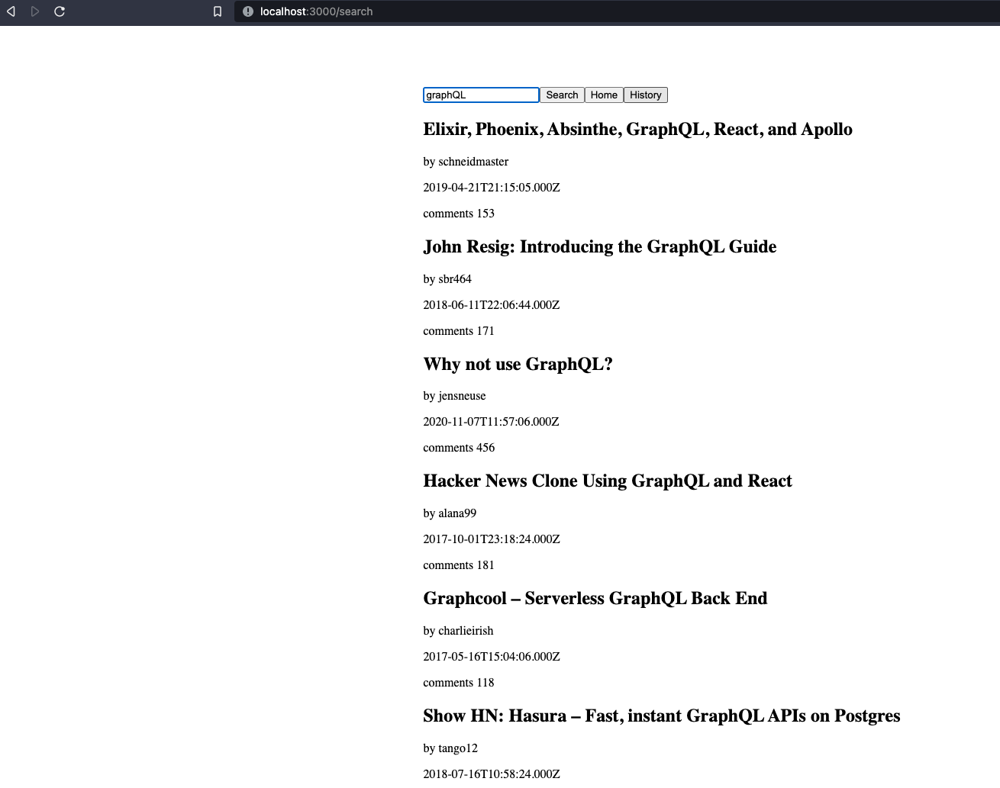
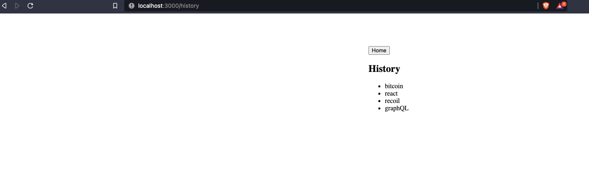

## Hacker News Search App
* “/search” lets the user search the Hacker News Algolia API and displays a list of results (https://hn.algolia.com/api)
* “/history” shows the users a list of their past searches from this session (these do not need to persist through refresh).
* / is the homepage which displays two buttons: “Search” and “History”

<p align="center">
  
  
  
  
</p>

### Hosted here 
 [here](http://73.195.210.32:9180/)
 
### Installation
Use the package manager [yarn](https://yarnpkg.com/) to install 

```bash
cd frontend && yarn install
```

### Usage 
```bash
cd frontend && yarn start
```

### tech stack
* [React](https://reactjs.org/)
* [React Router](https://reacttraining.com/react-router/web/guides/quick-start)
* [Redux](https://redux.js.org/) # for state management,NOTE* it is not needed for this project, but it was in the job description bonus points.
* [Redux-Thunk](https://github.com/reduxjs/redux-thunk) # for async actions
* [React-Redux](https://react-redux.js.org/)
* [API](http://hn.algolia.com/api/v1/)
* [Axios](https://axios-http.com/docs/intro)