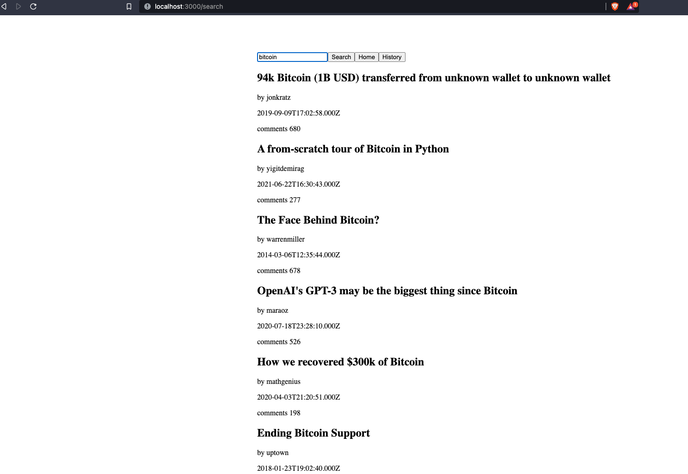

## Hacker News Search App
* “/search” lets the user search the Hacker News Algolia API and displays a list of results (https://hn.algolia.com/api)
* “/history” shows the users a list of their past searches from this session (these do not need to persist through refresh).
* / is the homepage which displays two buttons: “Search” and “History”

  
  
  
  

# Hosted here 
 [here](http://hn.rayanr.com)
 
